# DevOps Project README

Hey Folks 🖐️, This repository contains a Nodejs DevOps project that leverages various technologies, including Terraform, Ansible, Docker, EKS cluster, Helm, jenkins, prometheus, grafana and kubectl to automate the deployment and management of an application on Amazon EKS.
## Table of Contents

1. [Introduction](#introduction)
2. [Project Design](#project-design)
3. [Tools](#tools)
4. [Prerequisites](#prerequisites)
5. [Installation Guide](#installation-guide)
6. [Access Bootstrap Server](#access-bootstrap-server)
7. [Pictures](#pictures)

## Introduction

This DevOps project aims to automate the provisioning, deployment, and management of node js applications on an Amazon EKS cluster using Terraform for infrastructure provisioning, Ansible for configuration management, Docker for containerization, terraform for EKS cluster creation, kubectl for Kubernetes cluster management, Helm for package management, prometheus for monitoring cluster, grafana for visualization,  and Jenkins for continuous integration and continuous deployment (CI/CD).

In this project, Terraform is used to provision infrastructure, including 3 EC2 instances:

- **bootstrap-server**: Used to install kubectl and eksctl, and build the EKS cluster.
- **ansible-server**: Utilized for necessary configuration on the target hosts.
- **jenkins-master**: Employed to run Jenkins build jobs.

Helm is utilized to package the application, and the Helm charts are uploaded to an S3 bucket using Terraform.

## Project Design

## Tools

- Terraform (IaC)
- Ansible (Configuration Management)
- Docker (Containerization Application)
- Kubernetes (Containers Orchestration)
- Helm (Package Manager)
- Jenkins (CI/CD)
- Prometheus (Monitoring)
- Grafana (Visualization)

## Prerequisites
* Terraform must to be installed
## Installation Guide

1. Download or clone the repository to your local machine.

2. Install Terraform your local machine if you haven't already done so.

3. Make the necessary changes in the provider.tf file, specifically the project name and region, to match your own project settings

4. Navigate to the Terraform directory and initialize it by running the command `terraform init`

5. Run the command `terraform validate` to validate your terraform code , then `terraform plan` to review the infrastructure changes that
terraform will apply.

6. After reviewing the changes, run the command `terraform apply` to apply the changes to your infrastructure

Note: this guide assumes that you have a basic understanding of Docker, Terraform, and AWS Platform.
  
### Access Bootstrap Server

1. To ssh into the vm-instance run this command \
`ssh -o StrictHostKeyChecking=no -i bootstrap-key.pem ec2-user@<ec2-instance-ip>`

- Note: You Will find that the kubectl already installed using script created by ansible. no need to install it manually
- Note: You Will find that the ingress controller and prometheus-grafana stack already installed using script created by helm. no need to install it manually

## Pictures

### AWS - EC2 Instances

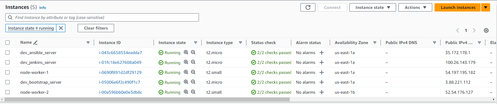

### AWS Cluster

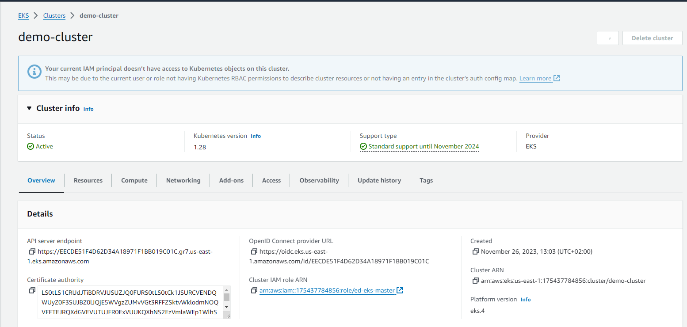

### AWS LoadBalancers

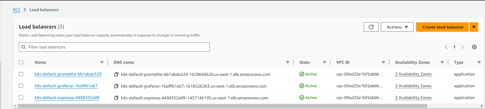

### AWS S3 Bucket

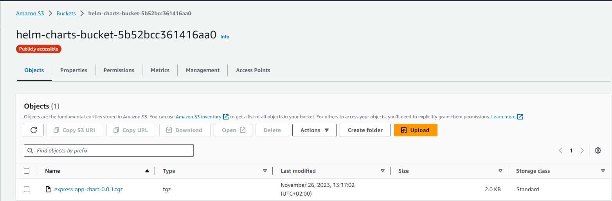

### Jenkins Clouds (Kubernetes)
Note: I used this plugin build dynamic agents on the cluster which help me to save costs

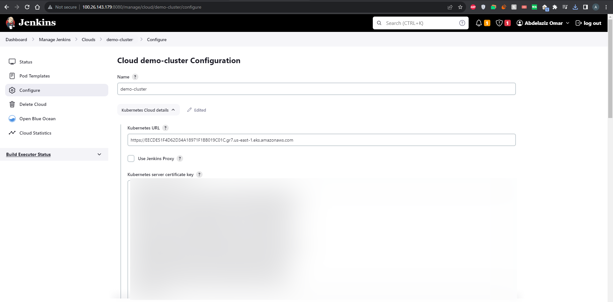

### Jenkins Ocean Blue (Plugin)

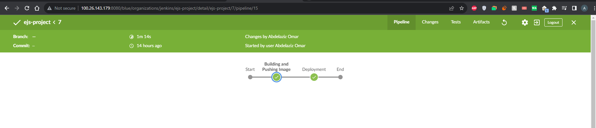
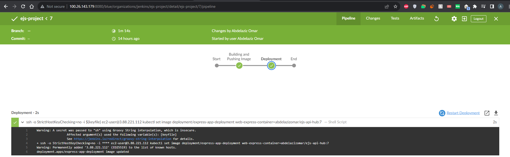

### Jenkins Credentials

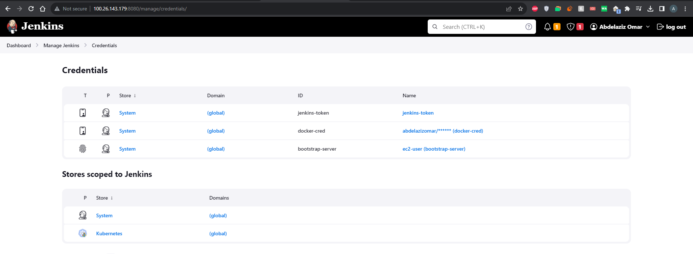

### Application

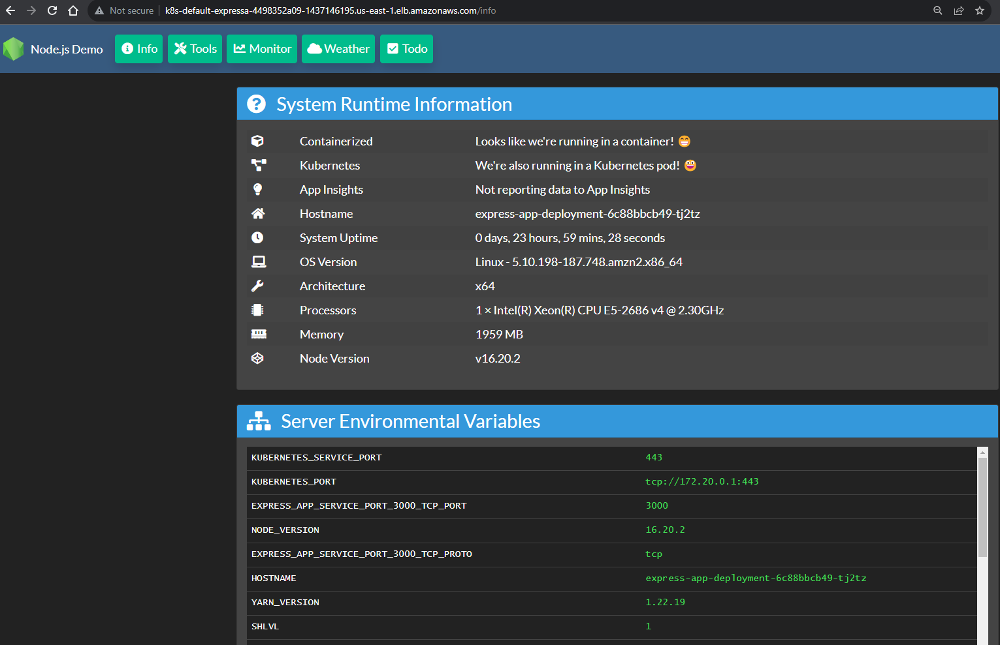
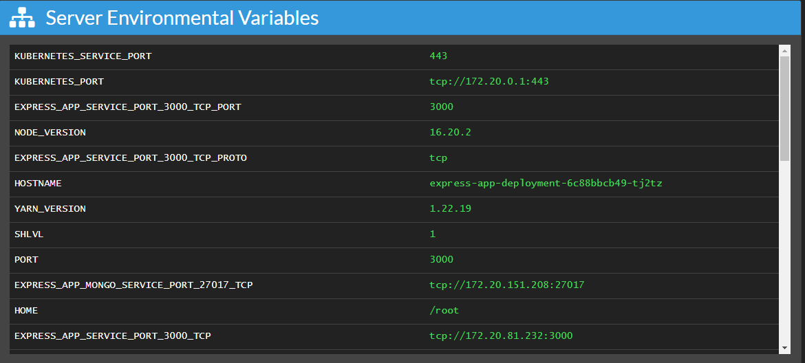
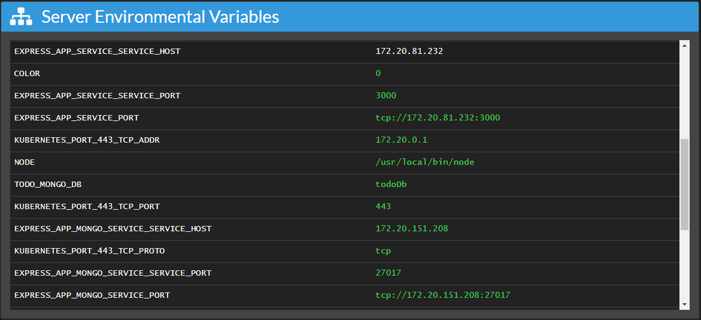
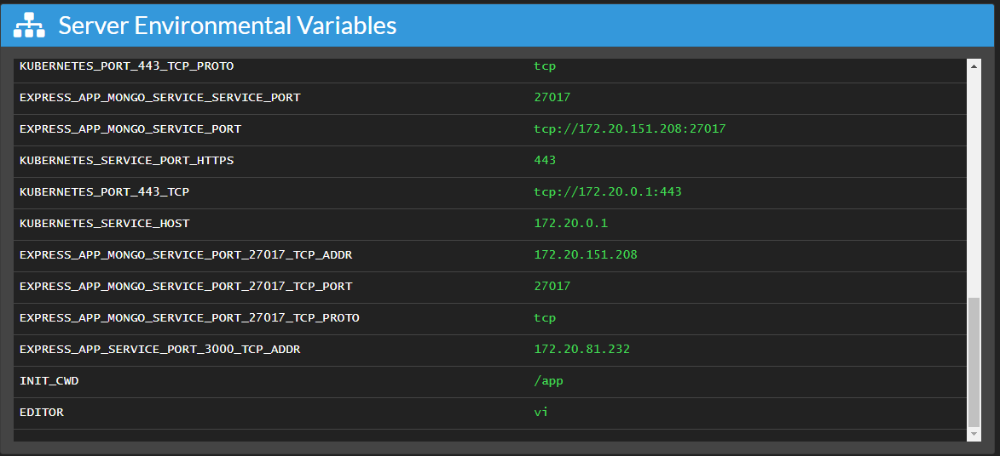
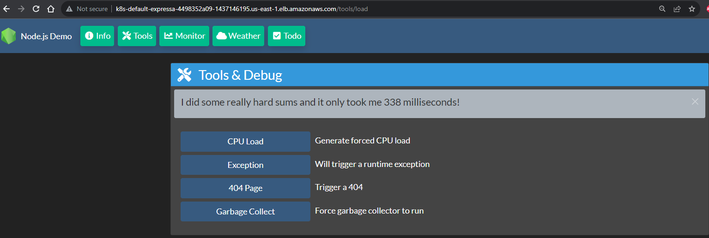
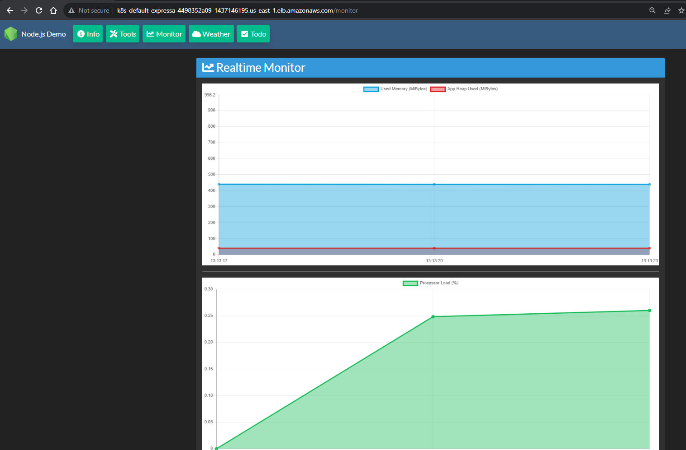
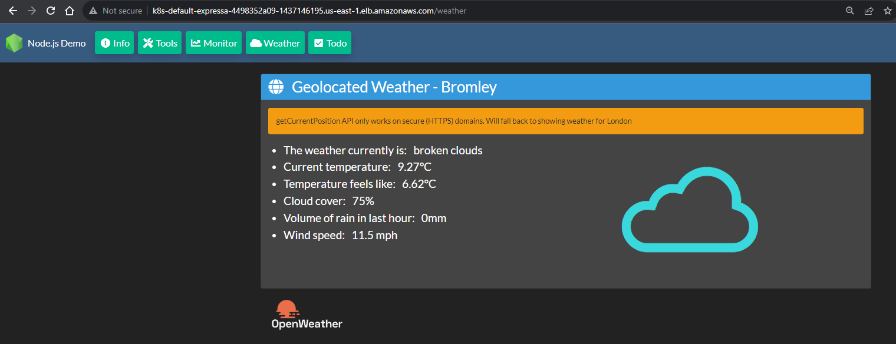
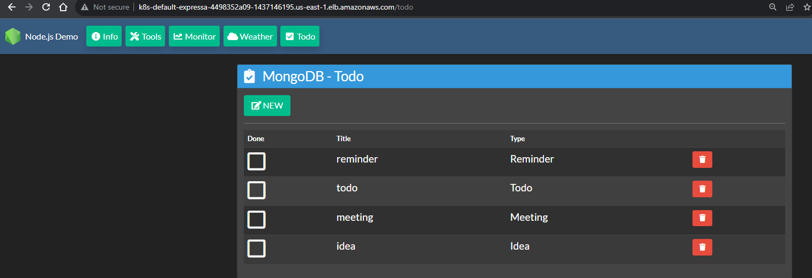

### Prometheus

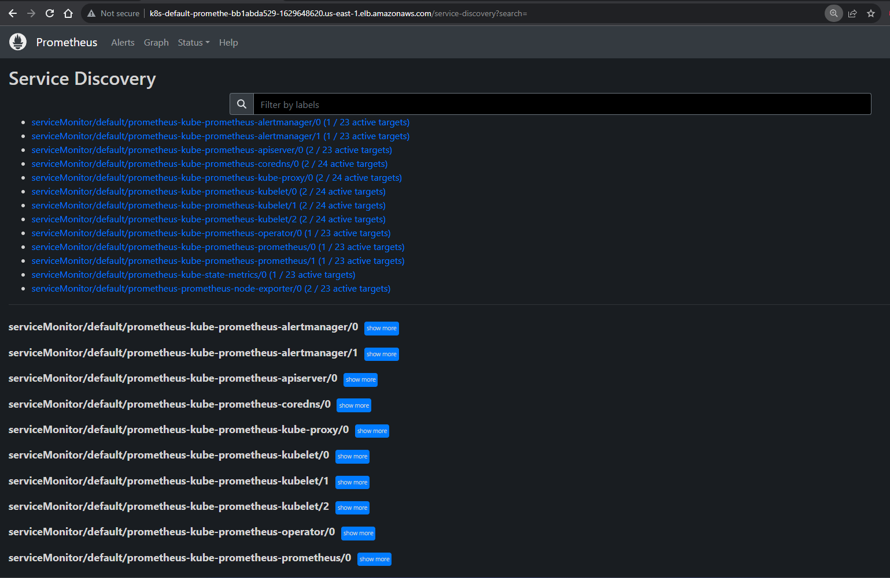
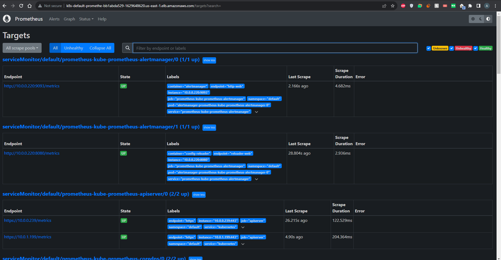

### Grafana

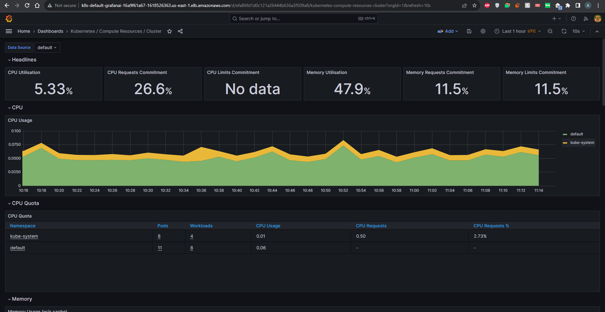
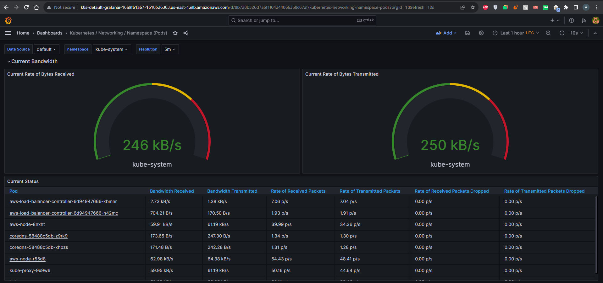
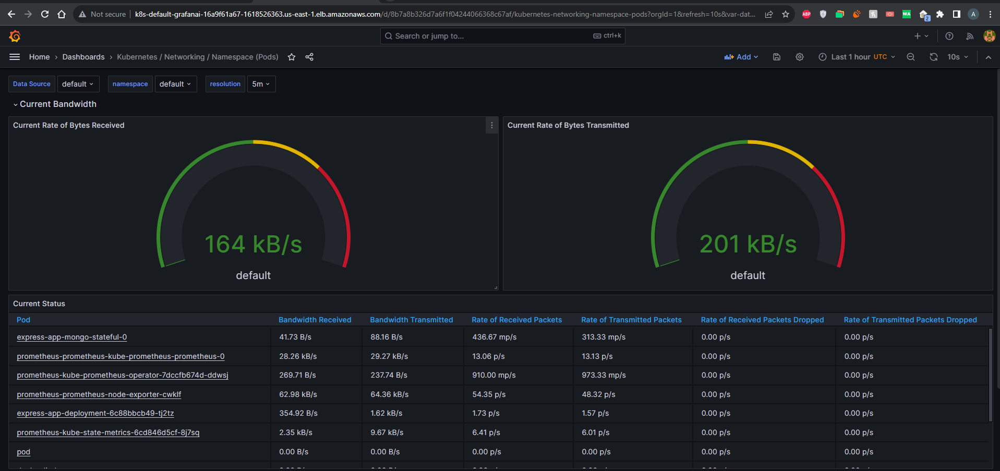
